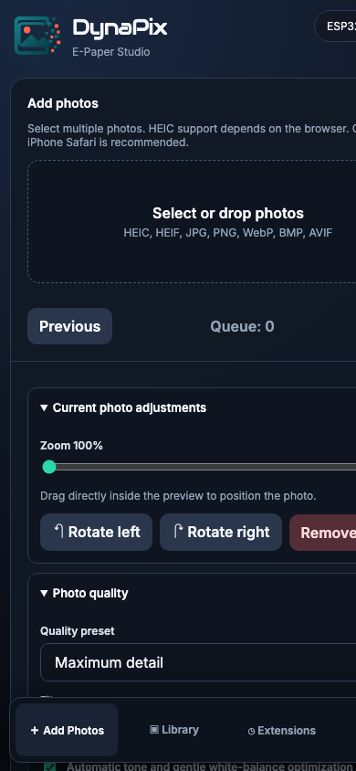
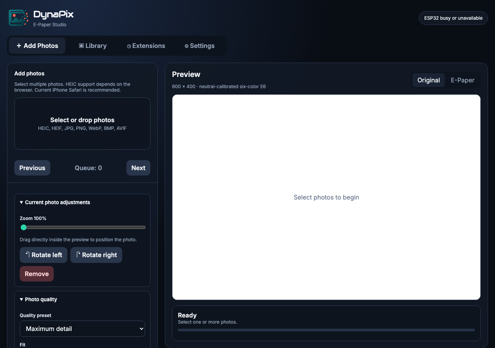

# DynaPix Photo Frame — Quick Setup Guide

Get your DynaPix frame online and showing photos in about 10 minutes.

---

## What you need

- DynaPix Photo Frame (ESP32-S3 + Waveshare 4" E6 e-paper display)
- USB-C power supply (5 V)
- A phone, tablet, or computer with Wi-Fi

---

## 1. Power on the frame

Plug the USB-C cable into the frame. The display may stay blank for a few seconds while the ESP32 boots; this is normal because e-paper retains the last image.

Wait until the activity LED settles and the fallback access point is active (about 10–20 seconds).

---

## 2. Connect to the fallback Wi-Fi

On your phone or computer, open Wi-Fi settings and connect to:

- **Network name (SSID):** `DynaPix-EPaper`
- **Password:** `dynapix6`

The frame is now acting as a temporary access point so you can configure it.

---

## 3. Open the DynaPix web UI

Open a web browser and go to one of these addresses:

- `http://dynapix.local`
- `http://192.168.4.1`

If `dynapix.local` does not resolve, use the IP address.

---

## 4. Configure your home Wi-Fi

1. Tap **Settings** in the bottom navigation bar.
2. Tap **Scan Wi-Fi**.
3. Select your home network from the dropdown.
   - The **Wi-Fi name** field fills in automatically.
4. Type your Wi-Fi password.
5. Tap **Save Wi-Fi**.

The frame restarts and joins your home network. The saved credentials survive power outages.

> **Tip:** If your network has no password, check **This is an open network**.

---

## 5. Reconnect to the frame on your home network

After the frame restarts:

1. Reconnect your phone/computer to your home Wi-Fi.
2. Open `http://dynapix.local` (or the frame's IP shown on the Settings page).

---

## 6. Upload your first photos

1. Tap **＋ Add Photos**.
2. Tap or drag photos into the drop zone.
   - Supported formats: HEIC, HEIF, JPG, PNG, WebP, BMP, AVIF
3. Use the preview and quality sliders if you want to adjust the look.
4. Tap **Convert & Upload All**.

Wait for the conversion and upload to complete. A 120 KB file is sent to the frame for each photo.

---

## 7. Start the slideshow

1. Tap **▣ Library**.
2. Select the photos you want to show, or tap **Select All**.
3. Tap **▷ Start**.

The frame begins cycling through the selected photos. The default interval is 5 minutes.

---

## Next steps

- Change the device name or hostname in **Settings**.
- Create photo categories in **Library → Categories**.
- Try the **Clock & Weather** or **Calendar** extensions.
- See the **Full User Manual** for detailed settings and troubleshooting.

---

## Quick troubleshooting

| Problem | Quick fix |
|---|---|
| Cannot open `dynapix.local` | Use `http://192.168.4.1` while connected to `DynaPix-EPaper`, or check your router for the frame's IP. |
| Upload fails or stalls | Make sure the photo file is valid and the frame has free storage (shown in Library). |
| Slideshow will not start | Select at least one photo in the Library first. |
| Display stays blank | E-paper only refreshes when a new image is requested. Start the slideshow or display a photo manually. |
| Forgot Wi-Fi settings | A factory reset wipes all settings; you will reconnect via `DynaPix-EPaper` and reconfigure. |
